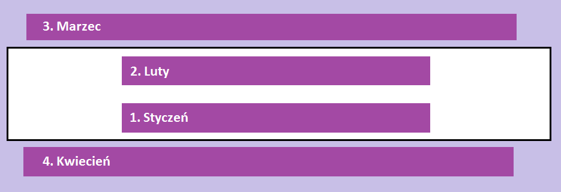

# Modyfikowanie elementów

### Zadanie 1
Stwórz element ```div``` z **klasą** ```panel``` i wstaw go za sekcją ```people```. Przy pomocy jQuery wstaw w niego dowolny tekst.

### Zadanie 2
Znajdź w pliku **index.html** element z **klasą** ```people```. Stwórz odpowiednią funkcję, wewnątrz której ustawisz event ```click``` na przycisku ```dodaj```.

Po kliknięciu wykonaj następujące czynności:
1. Pobierz do zmiennej wartość wpisaną w pole z **id** ```addUser```
2. Pobierz do zmiennej wartość wpisaną w pole z **id** ```age```
3. Wstaw nowy element na koniec listy, ustaw wprowadzony wiek jako atrybut ```data```
4. Po każdym wstawieniu elementu wywołaj funkcję, która ustawi odpowiedni kolor dla elementu **li** w następujący sposób:
  * zielony dla osób w wieku do 15 lat
  * niebieski dla osób mających od 16 do 40 lat
  * czerwony dla osób mających 41 lat i więcej

### Zadanie 3
Znajdź w pliku **index.html** element z **klasą** ```graphic```. Napisz funkcję, która utworzy elementy **span** i doda je w odpowiednie miejsca według poniższego obrazka.
Zastąp nazwy miesięcy nazwami poszczególnych funkcji, z których korzystasz, np. ```append```.



### Zadanie 4
Zapoznaj się z plikiem **index.html**. Znajdź w nim elementy z **klasą** ```block```, a następnie zapisz je do zmiennej. Napisz funkcję, która po kliknięciu elementu z **klasą** ```block``` usunie dany element z kolumny z **klasą** ```left``` i przeniesie go do kolumny z **klasą** ```right```.
